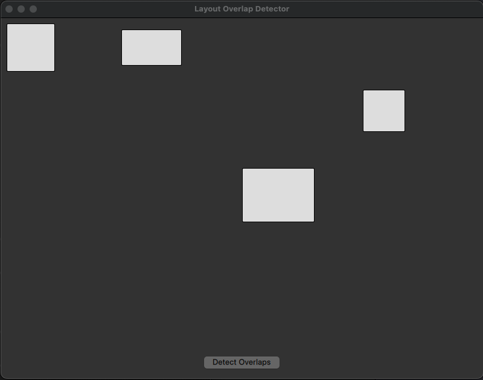
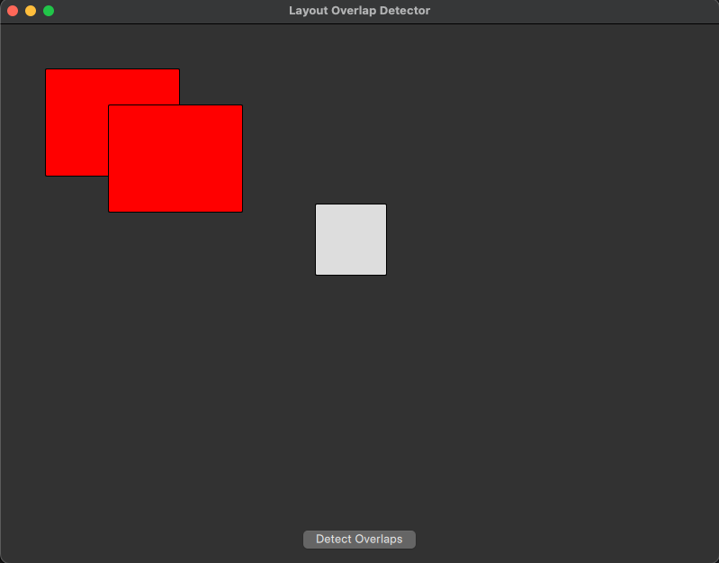

````markdown
<p align="center">
  
</p>

# LayoutOverlapDetector

[](#build--run)  
[](LICENSE)

**A Qt 6 / QML demo** showcasing a high-performance sweep-line overlap detection engine. Load rectangle layouts from JSON, detect overlaps in **O(n log n)** time on a background thread, and highlight them in real time—mimicking the core geometry check in Siemens Calibre DESIGNrev.

---

## 🌟 Features

- 🔍 **Sweep-Line Algorithm** (O(n log n))  
- ⚙️ **Background Threading** with `QThread`  
- 🎨 **Dynamic UI** via `QAbstractListModel` + QML `Repeater`  
- 🐍 **JSON-Driven Layouts** (nlohmann-json)  
- 🏁 **One-Step Setup** script (`setup.sh`)  
- 📦 **Cross-Platform** (macOS & Linux support)

---

## 📋 Table of Contents

1. [Why This Project?](#why-this-project)  
2. [System Requirements](#system-requirements)  
3. [Quick Start](#quick-start)  
4. [Usage](#usage)  
5. [Project Structure](#project-structure)  
6. [Core Components](#core-components)  
   - [JSON Layouts](#json-layouts)  
   - [Sweep-Line Algorithm](#sweep-line-algorithm)  
   - [Threading Model](#threading-model)  
   - [Qt Quick UI](#qt-quick-ui)  
7. [Sample Scenarios](#sample-scenarios)  
8. [Extending & Next Steps](#extending--next-steps)  
9. [Repository Hygiene](#repository-hygiene)  
   - [.gitignore](#gitignore)  
   - [Screenshots](#screenshots)  
   - [Prebuilt Binaries](#prebuilt-binaries)  
10. [Contributing](#contributing)  
11. [License](#license)  

---

## Why This Project?

Design Rule Checking (DRC) in chip sign-off requires verifying **no illegal overlaps** among millions of polygons. A naive O(n²) check is impractical; the sweep-line technique brings this down to **O(n log n)**.  
This demo distills that concept into:

1. **JSON-driven** rectangle data.  
2. A **background** sweep-line pass.  
3. A **responsive** Qt Quick interface highlighting overlaps.

Perfect for learning EDA-style geometry checks, modern C++/Qt best practices, and multi-threaded UI workflows.

---

## System Requirements

| Component          | macOS (Homebrew)              | Ubuntu / Debian                                        |
|--------------------|-------------------------------|--------------------------------------------------------|
| C++ Toolchain      | Xcode CLI Tools               | `build-essential`                                     |
| CMake ≥ 3.16       | `brew install cmake`          | `sudo apt install cmake`                              |
| Qt 6               | `brew install qt6`            | `sudo apt install qt6-base-dev qt6-declarative-dev`   |
| nlohmann-json      | `brew install nlohmann-json`  | `sudo apt install nlohmann-json3-dev`                 |
| Python 3           | `brew install python3`        | `sudo apt install python3`                            |
| GoogleTest (opt.)  | `brew install googletest`     | `sudo apt install libgtest-dev`                       |

---

## Quick Start

```bash
git clone https://github.com/your-org/LayoutOverlapDetector.git
cd LayoutOverlapDetector

# One-step setup (macOS/Linux)
./setup.sh

# OR manual build
mkdir build && cd build
cmake .. -DCMAKE_BUILD_TYPE=Release
cmake --build .
````

---

## Usage

```bash
# From build/
./LayoutOverlapDetector          # loads sample_layout.json
./LayoutOverlapDetector cluster.json
./LayoutOverlapDetector edge_touch.json
```

* **Gray** rectangles = non-overlapping
* **Red** rectangles = detected overlap after clicking **Detect Overlaps**

---

## Project Structure

```
LayoutOverlapDetector/
├── CMakeLists.txt           # Build configuration
├── setup.sh                 # One-step install, build & run
├── include/                 # Public headers
│   ├── Rectangle.h
│   ├── OverlapEngine.h
│   ├── LayoutModel.h
│   └── WorkerThread.h
├── src/                     # Source code
│   ├── Rectangle.cpp
│   ├── OverlapEngine.cpp
│   ├── LayoutModel.cpp
│   ├── WorkerThread.cpp
│   └── main.cpp
├── resources/
│   ├── qml/
│   │   └── MainView.qml     # QML UI
│   └── layouts/
│       ├── sample_layout.json
│       ├── no_overlap.json
│       ├── single_overlap.json
│       ├── nested_overlap.json
│       ├── edge_touch.json
│       └── cluster.json
│   └── resources.qrc        # QML embedding
├── scripts/
│   └── generate_layout.py   # Random JSON generator
├── docs/
│   └── images/              # Screenshots
└── LICENSE
```

---

## Core Components

### JSON Layouts

Each layout is an array of rectangles:

```json
[
  { "id": 0, "x": 10, "y": 10, "w": 80, "h": 80 },
  { "id": 1, "x":200, "y": 20, "w":100, "h": 60 }
]
```

* **id**: unique identifier
* **x, y**: top-left pixel coords
* **w, h**: width & height in pixels

### Sweep-Line Algorithm

1. **Event creation**: enter (x) & exit (x+w).
2. **Sort** events by x (O(n log n)).
3. **Active set** (BST keyed by y).
4. **Sweep** through events:

   * On **enter**: test Y-interval against active set → mark overlaps
   * On **exit**: remove from active set
5. **Result**: each rectangle’s `overlaps` flag is set if any intersection occurred.

### Threading Model

* Overlap detection runs in a **background** `WorkerThread` (`QThread`).
* UI thread posts results back via `invokeMethod(..., Qt::QueuedConnection)`—no blocking.

### Qt Quick UI

```qml
ApplicationWindow {
  width:800; height:600
  Repeater { model: layoutModel
    Rectangle {
      x:      rectX
      y:      rectY
      width:  rectW
      height: rectH
      color:  overlaps ? "red" : "#dddddd"
      border.color: "black"
    }
  }
  Button { text: "Detect Overlaps"
    onClicked: controller.onDetectClicked()
  }
}
```

* **layoutModel** exposes roles: `rectX`, `rectY`, `rectW`, `rectH`, `overlaps`
* **controller** handles the button click

---

## Sample Scenarios

| File                  | Description                         |
| --------------------- | ----------------------------------- |
| `no_overlap.json`     | No overlaps → all gray              |
| `single_overlap.json` | One overlapping pair → two reds     |
| `nested_overlap.json` | Rectangle within another → two reds |
| `edge_touch.json`     | Shared edges only → all gray        |
| `cluster.json`        | Multiple overlaps in a cluster      |

---

## Extending & Next Steps

* **Import real EDA data** (GDSII/DEF → JSON)
* **Pan & Zoom** in QML (`WheelHandler`, `PinchArea`)
* **Benchmarks**: log runtime vs. rectangle count
* **Unit Tests**: add GoogleTest under `tests/`
* **CI Integration**: GitHub Actions for build/tests/benchmarks

---

## Repository Hygiene

### `.gitignore`

```gitignore
/build/
*.o
*.obj
*.exe
.DS_Store
```

### Screenshots

1. Capture your app window as PNG.
2. Place into `docs/images/` and commit.
3. Embed in README:

   ```markdown
   
   
   ```

### Prebuilt Binaries

1. Build & zip the executable:

   ```bash
   cd build
   zip LayoutOverlapDetector.zip LayoutOverlapDetector
   ```
2. Go to GitHub **Releases**, draft a new release, and upload the ZIP.

---

## Contributing

Bug reports, feature requests, and pull requests are welcome!
Please open an issue or submit a PR.

---

## License

**MIT License** — see [LICENSE](LICENSE) for details.

```
```
